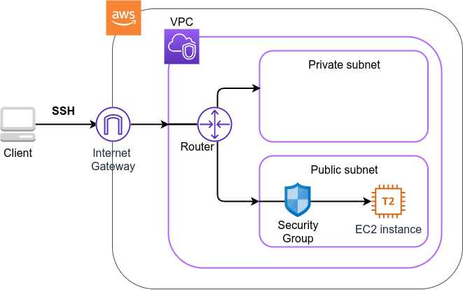

# Hands-on #1: Launching an EC2 instance

- [Hands-on #1: Launching an EC2 instance](https://tomomano.github.io/learn-aws-by-coding/#sec_first_ec2)



| Instance     | vCPU | Memory(GiB) | Network bandwidth(Gbps) | Price per hour($) |
| :----------- | :--- | :---------- | :---------------------- | :---------------- |
| t2.macro     | 1    | 1           | -                       | 0.0116            |
| t2.small     | 1    | 2           | -                       | 0.023             |
| t2.medium    | 2    | 4           | -                       | 0.0464            |
| c5.24xlarge  | 96   | 192         | 25                      | 4.08              |
| c5n.18xlarge | 72   | 192         | 100                     | 3.888             |
| x1e.16xlarge | 64   | 1952        | 10                      | 13.344            |

## Run

```shell
$ ./run.sh
```
## Destroy stack & ssh key pair

```shell
$ ./destroy.sh
```

## Results
```shell
$ ssh -i ~/.ssh/MyKey.pem ec2-user@54.95.46.126
The authenticity of host '54.95.46.126 (54.95.46.126)' can't be established.
ED25519 key fingerprint is SHA256:cQi4JzKE7L4xdOk2ClDkUHiYniR7KEjlMb4G4P6/PRQ.
This key is not known by any other names
Are you sure you want to continue connecting (yes/no/[fingerprint])? yes
Warning: Permanently added '54.95.46.126' (ED25519) to the list of known hosts.

       __|  __|_  )
       _|  (     /   Amazon Linux AMI
      ___|\___|___|

https://aws.amazon.com/amazon-linux-ami/2018.03-release-notes/
```

```shell
[ec2-user@ip-10-10-1-232 ~]$ cat /proc/cpuinfo 
processor	: 0
vendor_id	: GenuineIntel
cpu family	: 6
model		: 63
model name	: Intel(R) Xeon(R) CPU E5-2676 v3 @ 2.40GHz
stepping	: 2
microcode	: 0x49
cpu MHz		: 2400.086
cache size	: 30720 KB
physical id	: 0
siblings	: 1
core id		: 0
cpu cores	: 1
apicid		: 0
initial apicid	: 0
fpu		: yes
fpu_exception	: yes
cpuid level	: 13
wp		: yes
flags		: fpu vme de pse tsc msr pae mce cx8 apic sep mtrr pge mca cmov pat pse36 clflush mmx fxsr sse sse2 ht syscall nx rdtscp lm constant_tsc rep_good nopl xtopology cpuid pni pclmulqdq ssse3 fma cx16 pcid sse4_1 sse4_2 x2apic movbe popcnt tsc_deadline_timer aes xsave avx f16c rdrand hypervisor lahf_lm abm cpuid_fault invpcid_single pti fsgsbase bmi1 avx2 smep bmi2 erms invpcid xsaveopt
bugs		: cpu_meltdown spectre_v1 spectre_v2 spec_store_bypass l1tf mds swapgs itlb_multihit mmio_stale_data
bogomips	: 4800.02
clflush size	: 64
cache_alignment	: 64
address sizes	: 46 bits physical, 48 bits virtual
power management:
```

## Tips

- AWSでAccess Keyを作る際にはIAMユーザーでログイン後、鍵を作成する必要がある。
  - Rootユーザーで作成すると認証に失敗する。