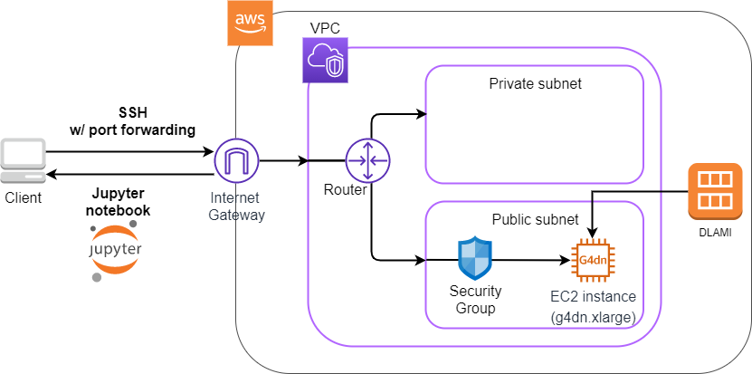

# Hands-on #2: Deep learning with AWS

- [Hands-on #2: Deep learning with AWS](https://tomomano.github.io/learn-aws-by-coding/#sec_jupyter_and_deep_learning)

| Instance     | GPUs | GPU model   | GPU Mem(GiB) | vCPU | Mem(GiB) | Price per hour($) |
| :----------- | :--- | :---------- | :----------- | :--- | :------- | :---------------- |
| p3.2xlarge   | 1    | NVIDIA V100 | 16           | 8    | 61       | 3.06              |
| p3n.16xlarge | 8    | NVIDIA V100 | 128          | 64   | 488      | 24.48             |
| p2.xlarge    | 1    | NVIDIA K80  | 12           | 4    | 61       | 0.9               |
| g4dn.xlarge  | 1    | NVIDIA T4   | 16           | 4    | 16       | 0.526             |

## DLAMI(Deep Learning Amazon Machine Image)
AMI(Amazon Machine Image)とは大まかにOSに相当するが、加えて各種のプログラムがインストール済みのAMIも定義することができる。
必要なプログラムがインストールされているAMIを使うことで環境構築が楽になる。(Dockerでいうベースイメージ)
ディープラーニングで使われるプログラムが事前にインストールしてあるAMIがDLAMI(Deep Learning AMI)である。
DLAMIには`TensorFlow`や`PyTorch`などのディープラーニングのフレームワーク・ライブラリがインストールされている。
このハンズオンでは、Amazon Linux 2をベースにしたDLAMI(AMI ID: ap-northeast-1=ami-09c0c16fc46a29ed9, us-east-1=ami-060f07284bb6f9faf)を使用。
※AMIのIDはリージョンごとで違うので注意