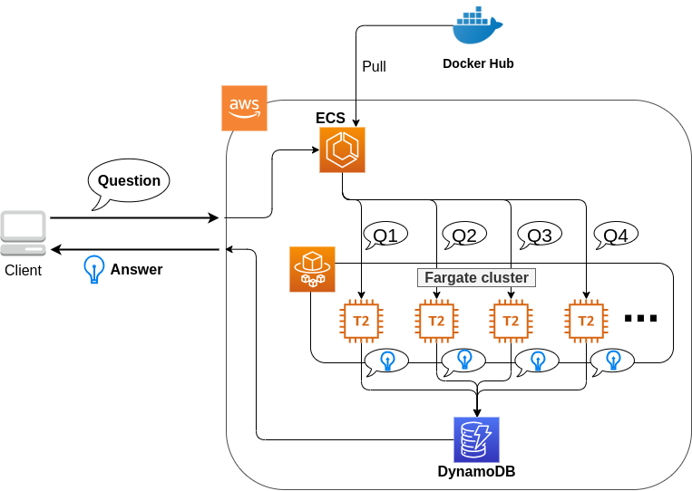

# Hands-on #3: Creating a Transformer-based Q&A bot system

- [Hands-on #3: Creating a Transformer-based Q&A bot system](https://tomomano.github.io/learn-aws-by-coding/#sec_jupyter_and_deep_learning)

## Elastic Container Service(ECS)
Elastic Container Service(ECS)とは、Dockerを使った計算機クラスターをAWS上に作成するためのツールである。
ECSを使用することで、Dockerにパッケージされたアプリケーションを計算機クラスターに投入したり、計算機クラスターのインスタンスを追加・削除する操作（スケーリング）を行うことができる。

ECSは **タスク(Task)** と呼ばれる単位で管理された計算ジョブを受け付ける。システムにタスクが投入されると、ECSは最初にタスクで指定されたDockerイメージを外部レジストリ、Docker HubやAWS独自のDockerレジストリであるECR(Elastic Container Registry)からダウンロードしてくる。

上の図のECS管理化のクラスターの中で計算を行う実態としては、**EC2あるいはFargate**の２つの選択肢がある。EC2を用いた場合は、前章のような流れでインスタンスが生成され、計算が実行されるが、EC2を用いた計算機クラスターの作成・管理は技術的な難易度が高い。

## Fargate
Fargateとは、**ECSでの利用に特化**して設計された、**コンテナを使用した計算タスク**を走らせるための仕組みである。FargateはEC2と違い物理的な実態は持たないため、SSHでのログインや別途ソフトウェアをインストールすることはできず、すべてDockerコンテナを介して行われる。
Fargateを利用する際には、ユーザーは所望のDockerイメージを指定・作成しておき、Fargateは`docker run`コマンドを使用することで計算タスクを実行する。